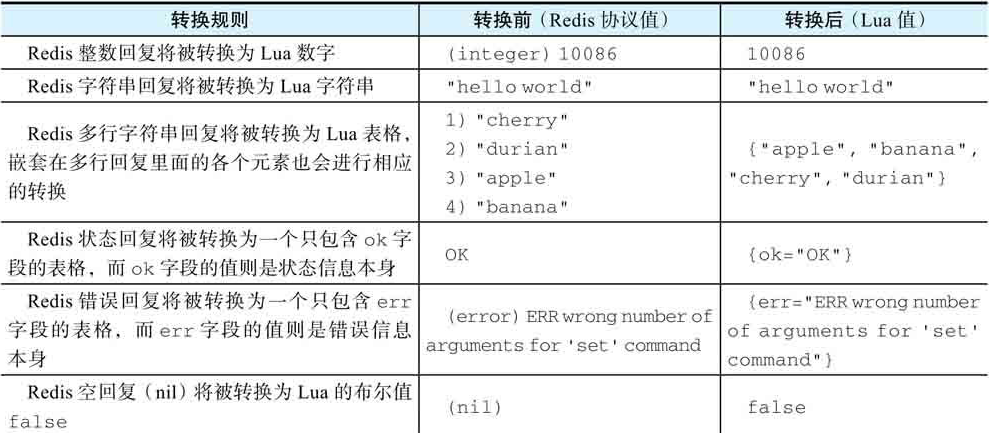
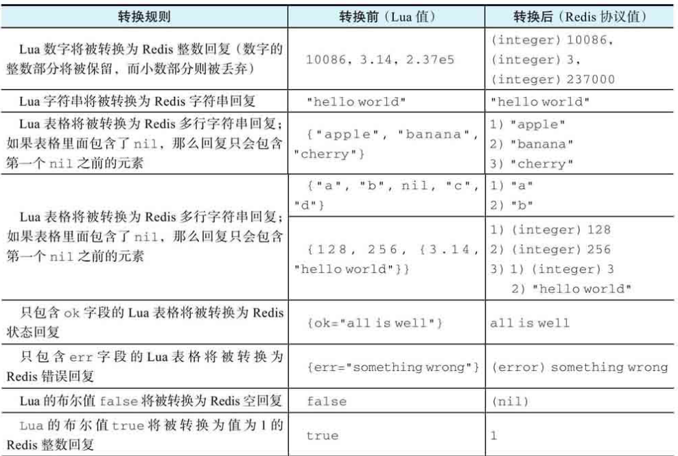

# Lua脚本

> redis从2.6.0版本引入，内置Lua解释器，可以执行指定格式Lua脚本，被执行的脚本可以直接调用Redis命令，并使用Lua语言及其内置的函数库处理命令结果。

## Lua带给Redis的变化

- 使得用户可以使用除了修改Redis服务器源码以外的方式按需扩展Redis服务器的功能，并且无后顾之忧。
- redis服务器执行Lua脚本是原子性的
- redis服务器会一次性执行整个Lua脚本，不管脚本中有多少条操作命令，且Redis提供的Lua脚本缓存特性能够更为有效地减少带宽使用
- Redis在Lua环境中内置了许多有用的包，通过这些包，可以直接在服务器端对数据进行处理，然后把结果存储到数据库中，减少了很多网络传输操作

## 常用命令

### 执行脚本

```shell
EVAL script numkeys key [key ...] arg [arg ...]
```

- script：用于传递脚本本身（依据内置的Lua解释器版本而定）
- numkeys：指定脚本需要处理的键数量
- key：指定需要被脚本处理的键，在脚本中可以通过`KEYS`数组进行访问，数组索引从1开始
- arg：指定传递给脚本的附加参数，在脚本中可以通过`ARGV`数组访问，索引从1开始

例如

```shell
EVAL "return 'hello world'" 0
> "hello world"
```

## 脚本中执行redis命令

```shell
redis.call(command, ...)
redis.pcall(command, ...)
```

通过在脚本中调用上述两个函数实现，这两个函数第一个参数表示redis命令的名字，后面的参数则表示任意多个命令参数。

例如

```shell
redis> EVAL "return redis.call('SET', KEYS[1], ARGV[1])" 1 "message" "hello world"
OK
redis> GET "message"
"hello world"
```

两个函数的不同之处在于，call()命令中如果报错，则该命令会引发一个Lua错误，迫使EVAL命令向调用者返回一个错误；pcall()命令则会把错误包装成一个table类型（Lua表格）的数据并返回

## 值转换问题

redis在引入了Lua环境之后，redis服务器中出现了两种环境，一种是redis命令执行器所处的环境，另一种是Lua环境，因为这两种环境使用不同的输入和输出，所以在这两种环境之间传递值将引发相应的转换操作：

### 将Redis协议值转换为Lua值

 

### 将Lua值转换为Redis协议值

 

### 注意

1. 由于lua浮点数值转redis值时，只会保留整数部分，所以需要先转字符串，在进行lua字符串值转redis字符串值，然后再进行类型转换
   ```shell
   redis> EVAL "return 3.14" 0
   3
   redis> EVAL "return tostring(3.14)" 0
   "3.14"
   ```

   

## Lua环境的全局变量保护

为了防止预定义的Lua环境被污染，Redis只允许用户在Lua脚本中创建局部变量而不允许创建全局变量

## 切换数据库

允许在脚本中使用`SELECT`命令切换数据库，在2.8.12版本之前，用户在脚本中切换数据库之后，客户端使用的数据库也会进行切换；在2.8.12及之后的版本，脚本中切换数据库只会对脚本自身产生影响，不会影响到客户端。

## 原子性

redis服务器在开始执行`EVAL`命令之后，直到`EVAL`命令执行完毕并向调用者返回结果之前，Resis服务器只会执行`EVAL`命令给定的脚本及其包含的Redis命令调用，至于其它客户端发送的命令则会被阻塞。

所以，用户在使用Lua脚本的时候，必须尽可能保证脚本能够高效、快速地执行，来避免因为独占服务器而给其他客户端造成影响

## 以命令方式执行脚本

lua脚本如下，脚本名称为`set_and_get.lua`

```lua
redis.call("SET", KEYS[1], ARGV[1])
return redis.call("GET", KEYS[1])
```

命令如下

```shell
$ redis-cli --eval set_and_get.lua 'msg', 'Ciao'
> "Ciao"
```

只需要在传入键和附件参数之间使用逗号隔开即可

## 缓存并执行脚本

Redis提供了Lua脚本缓存功能，该功能允许将用户给定的Lua脚本缓存在服务器中，然后根据Lua脚本的`SHA1`校验和来直接调用脚本，可以避免客户端需要重复发送相同脚本带来的对于网络带宽的浪费。

```shell
redis> SCRIPT LOAD script
```

该命令将指定的script缓存到服务器中，并返回脚本对应的`SHA1`校验和

```shell
redis> EVALSHA sha1 numkeys key [key ...] arg [arg...]
```

用户使用该命令来执行已经被缓存到服务器上的Lua脚本。

- sha1：服务器之前返回的脚本的`SHA1`校验和
- numkeys：指定脚本需要处理的键数量
- key：指定需要被脚本处理的键，在脚本中可以通过`KEYS`数组进行访问，数组索引从1开始
- arg：指定传递给脚本的附加参数，在脚本中可以通过`ARGV`数组访问，索引从1开始

`EVAL`命令执行完后，也会把脚本缓存在服务器上，但是由于`EVAL`命令不会返回`SHA1`校验和，所以需要用户通过其他方式先计算出校验和

### 检查脚本是否被缓存

```shell
redis> SCRIPT EXISTS sha1 [sha1 ...]
```

该命令接受一个或多个sha1校验和作为参数，检查这些检验和对应的脚本是否已经被缓存到服务器中。存在的返回1，不存在的返回0。

### 移除所有已缓存脚本

```shell
redis> SCRIPT FLUSH
```

该命令将移除服务器已缓存的所有脚本

### 强制停止正在运行的脚本

Lua脚本在执行时会独占整个服务器，当Lua脚本运行时间过长，或因为某些编程错误导致脚本无法退出时，会导致其他客户端一直无法执行命令。

```shell
lua-time-limit <milliseconds>
```

该配置项配置了Lua脚本可以不受限制运行的时长，默认是5000毫秒。当Lua脚本的运行时长低于这个值时，其他客户端发送的命令将被阻塞；当Lua脚本运行的时长超过这个值时，其他客户端向服务器发送命令将得到一个错误，提示用户可以使用`SCRIPT KILL`或`SHUTDOWN NOSAVE`命令来终止脚本或者直接关闭服务器。

```shell
SCRIPT KILL
```

该命令将终止Lua脚本执行，一般有两种情况：

1. 如果正在执行的脚本没有执行过任何写命令，那么服务器可以终止该脚本，然后回到正常状态，继续处理客户端命令请求
2. 如果脚本已经执行过写命令，并且因为脚本还没跑完，写入的数据可能不完整或者说是错误的，为了防止这些脏数据保存到数据库，服务器不会直接终止脚本。会提示用户要么等脚本自己执行完，要么执行`SHUTDOWN nosave`命令，在不执行持久化操作的情况下关闭服务器，然后通过手动重启服务器来让它回到正常状态。


## redis中Lua环境的[内置函数库](https://redis.io/docs/interact/programmability/lua-api) 

- base包
- table包
- string包
- math包
- redis包
- bit包
- struct包
- cjson包
- cmsgpack包

## [redis中Lua脚本的调试](https://redis.io/docs/interact/programmability/lua-debugging/) 


