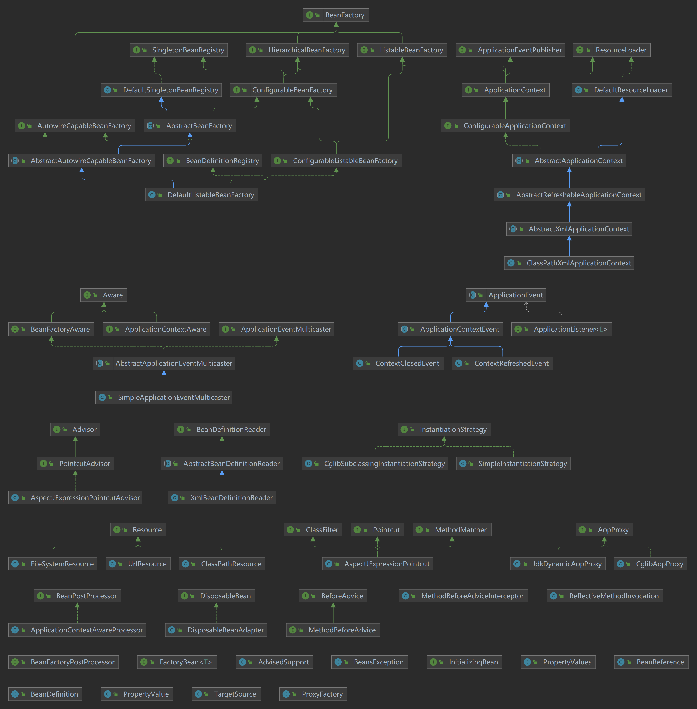

# Spring

## Spring基本概念

- 轻量级的开源JAVAEE框架
- 用来解决企业应用开发的复杂性
- 核心的两个组成部分 IoC（控制反转，把创建对象的过程交给框架管理），AOP（面向切面，不修改源代码进行功能增强）
- 特点：
  1. 方便解耦，简化开发
  2. AOP编程支持
  3. 方便程序测试（整合JUnit）
  4. 方便集合其他框架（Mybatis等）
  5. 方便进行事务操作
  6. 降低API开发难度

## 设计理念

- 对于各个应用场景提供不同的解决方案，例如选择持久化支持的依赖方面，可以有不同的选择，而在切换不同依赖的使用上，仅仅只需要更改配置而不是代码
- 向后兼容
- 强调代码质量

