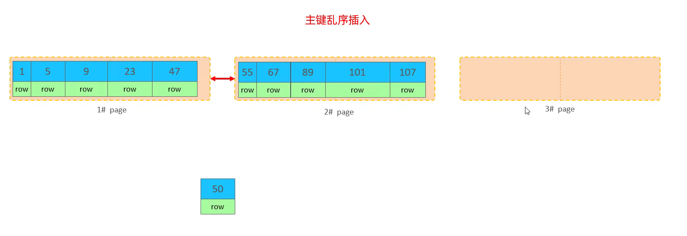
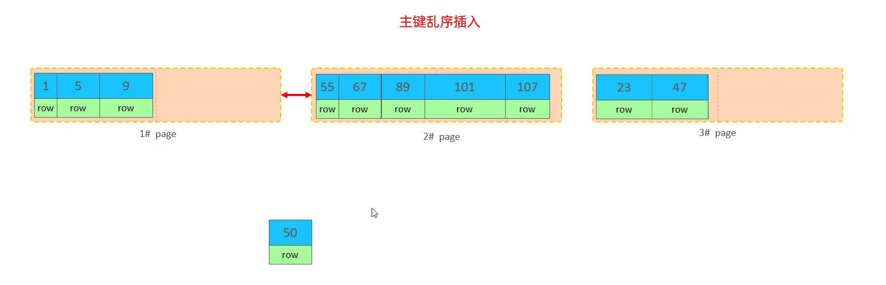
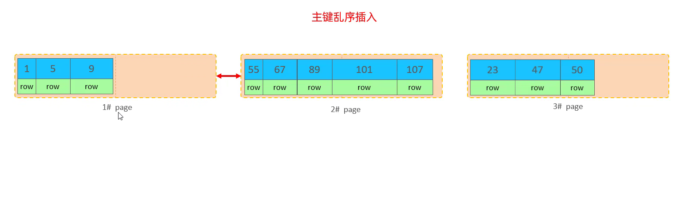
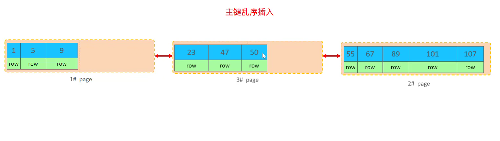
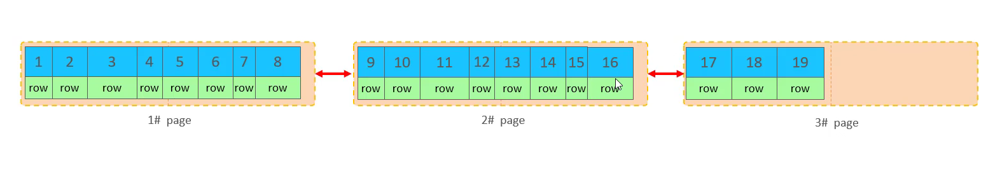
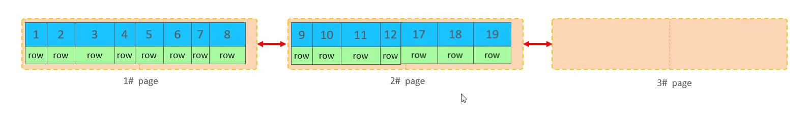
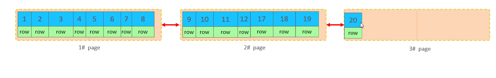

# `SQL`优化

## SQL性能分析

### SQL语句执行频次

`SHOW [GLOBAL|SESSION] STATUS` 可以查看服务器的状态信息，`SHOW GLOBAL STATUS LIKE 'Com_______'`可以查看服务器INCERT、UPDATE、DELETE、SELECT语句的频次。

```sql
SHOW GLOBAL STATUS LIKE 'Com_______';
```

执行结果

```
Com_binlog	0
Com_commit	0
Com_delete	0
Com_import	0
Com_insert	0
Com_repair	0
Com_revoke	0
Com_select	18
Com_signal	0
Com_update	0
Com_xa_end	0
```

通过观察频次，来确定该数据库主要是哪种语句过多，应该主要哪方面（比如查询）的性能。

### 慢查询日志

该日志记录了所有执行时间超过指定参数（long_query_time，单位秒，默认10秒）的所有SQL语句的日志。

查看是否开启慢查询日志，以及当前默认时间是多少

```sql
show VARIABLES like 'slow_query_log'
show VARIABLES like 'long_query_time'
```

开启慢查询日志，需要在MySQL的配置文件（/etc/my.cnf）中配置如下信息：

```bash
# 开启慢查询日志
slow_query_log = 1
# 设置慢日志的时间为2秒，SQL语句执行时间超过2s，就会被视为慢查询，记录慢查询日志
long_query_time = 2
```

一般日志存放位置为 `/var/lib/mysql/localhost-slow.log`

### ~~profile详情~~（`performance_schema`）

查看数据库版本是否支持profile，以及是否开启profile

```sql
# 查看是否支持profile
select @@have_profiling;
# 查看是否开启
select @@profiling;
# 开启profile
set profiling = 1;
# 关闭profile
set profiling = 0;
```


show profiles 能够在做SQL优化时帮助我们了解时间都耗费到哪里去了。

- 查看每一条SQL的耗时情况

  ```sql
  show profiles;
  ```

  结果如下

  | QueryId | Duration   | Query                |
  | ------- | ---------- | -------------------- |
  | 92      | 0.00091025 | SHOW STATUS          |
  | 110     | 0.0002535  | select * from `user` |

- 查看指定QueryId的SQL语句各个阶段的耗时情况

  ```sql
  show profile for query 110;
  ```

  结果如下

  | Satus                         | Duration |
  | ----------------------------- | -------- |
  | starting                      | 0.000054 |
  | Executing hook on transaction | 0.000003 |
  | starting                      | 0.000005 |
  | checking permissions          | 0.000004 |
  | Opening tables                | 0.000036 |
  | init                          | 0.000003 |
  | System lock                   | 0.000006 |
  | optimizing                    | 0.000003 |
  | statistics                    | 0.000011 |
  | preparing                     | 0.000013 |
  | executing                     | 0.000043 |
  | end                           | 0.000002 |
  | query end                     | 0.000002 |
  | waiting for handler commit    | 0.000005 |
  | closing tables                | 0.000005 |
  | freeing items                 | 0.000054 |
  | cleaning up                   | 0.000007 |

- 查看指定QueryID的SQL语句的CPU使用情况

  ```sql
  show profile cpu for query 110;
  ```

  | Satus                         | Duration | CPU_user | CPU_system |
  | ----------------------------- | -------- | -------- | ---------- |
  | starting                      | 0.000054 | 0.000000 | 0.000000   |
  | Executing hook on transaction | 0.000003 | 0.000000 | 0.000000   |
  | starting                      | 0.000005 | 0.000000 | 0.000000   |
  | checking permissions          | 0.000004 | 0.000000 | 0.000000   |
  | Opening tables                | 0.000036 | 0.000000 | 0.000000   |
  | init                          | 0.000003 | 0.000000 | 0.000000   |
  | System lock                   | 0.000006 | 0.000000 | 0.000000   |
  | optimizing                    | 0.000003 | 0.000000 | 0.000000   |
  | statistics                    | 0.000011 | 0.000000 | 0.000000   |
  | preparing                     | 0.000013 | 0.000000 | 0.000000   |
  | executing                     | 0.000043 | 0.000000 | 0.000000   |
  | end                           | 0.000002 | 0.000000 | 0.000000   |
  | query end                     | 0.000002 | 0.000000 | 0.000000   |
  | waiting for handler commit    | 0.000005 | 0.000000 | 0.000000   |
  | closing tables                | 0.000005 | 0.000000 | 0.000000   |
  | freeing items                 | 0.000054 | 0.000000 | 0.000000   |
  | cleaning up                   | 0.000007 | 0.000000 | 0.000000   |

### explain执行计划

通过explain/desc命令获取MySQL如何执行SELECT语句的信息，包括在SELECT语句执行过程中表如何连接和连接的顺序。

```sql
explain select columns_name from table_name where condition
```

- id
  select查询的序列号，表示查询中执行select子句或者是操作表的顺序（id相同，执行顺序从上到下；id不同，值越大越先执行）
- select_type
  表示select的类型，常见的取值有SIMPLE（简单表，即不使用表连接或者子查询）、PRIMARY（主查询，即外层的查询）、UNION（UNION中的第二个或者后面的查询语句）、SUBQUERY（select/where之后包含了子查询）等
- type
  表示连接类型，性能由好到差的连接类型为NULL（一般业务查询不可能优化到null，例如`select 'A'`）、system（一般是访问系统表）、const（一般根据主键或唯一索引访问）、eq_ref、ref（一般使用非唯一索引访问）、range、index、all（全表扫描）。
- possible_key
  显示可能应用在这张表上的索引，一个或多个
- Key
  实际使用的索引，如果为NULL，则没有使用索引
- Key_len
  表示索引中使用的字节数，该值为索引字段最大可能长度，并非实际使用长度，在不损失精确性的前提下，长度越短越好
- rows
  MySQL认为必须要执行查询的行数，在InnoDB引擎的表中，是一个估计值，可能并不总是精确的
- filtered
  表示返回结果的行数占需读取行数的百分比，越大越好
- Extra
  额外信息

## 插入数据

### insert优化

1. 批量插入，一次性插入语句大概500-1000比较合适，过多的话可以拆分为多条批量插入语句
   ```sql
   insert into tb_user values(1, 'Tom'),(2, 'Cat'), (3, 'Jerry');
   ```

2. 手动事务提交，由于MySQL事务提交方式是自动提交，那么意味着执行一条插入语句前，自动开始事务，执行完毕后自动提交；执行第二条再开启事务，执行结束自动提交，这样会频繁地开启/提交事务
   ```sql
   start transaction;
   insert into tb_user values(1, 'Tom'),(2, 'Cat'), (3, 'Jerry');
   insert into tb_user values(1, 'Tom'),(2, 'Cat'), (3, 'Jerry');
   insert into tb_user values(1, 'Tom'),(2, 'Cat'), (3, 'Jerry');
   commit;
   ```

3. 主键顺序插入

4. 大批量插入数据，可以使用MySQL提供的load指令进行插入
   ```sql
   # 客户端连接服务器时，加上参数 --local-infile
   mysql -local-infile -u root -p;
   # 设置全局参数local_infile为1，开启从本地加载文件导入数据的开关
   set global local_infile = 1;
   # 执行load指令将准备好的数据，加载到表结构中
   load data load infile '/root/sql.log' into table 'tb_user' fields terminated by ',' lines terminated by '\n';
   ```

   按照主键顺序插入性能更佳

## 主键优化

### 数据组织方式

在InnoDB存储引擎中，表数据都是根据主键顺序组织存放的，这种存储方式的表称为索引组织表（index organized table IOT）。

### 页分裂

页可以为空，也可以填充一半，也可以填满。每个页包含了2-N行数据，根据主键排列。


 


 

一般是50%的位置


 


 

### 页合并

当删除一行记录时，实际上记录并没有被物理删除，只是记录被标识（flaged）为删除并且它的空间变得允许被其他记录声明使用。

当页中删除的记录达到MERGE_THRESHOLD（默认为页的50%），InnoDB开始寻找最靠近的页（前或后）看看是否可以将两个页合并以优化空间使用

> MERGE_THRESHOLD: 合并页的阈值，可以自己设置，在创建表或者创建索引时指定


 


 


 


 

### 主键设计原则

1. 满足业务需求的情况下，尽量降低主键的长度。因为二级索引叶子节点存储的是主键，如果二级索引很多，主键过长，很占用空间
2. 插入数据时，尽量选择顺序插入，选择使用AUTO_INCREMENT自增主键
3. 尽量不要使用UUID做主键或者是其他自然主键，如身份证号
4. 业务操作时，避免对主键的修改

## order by优化

> Using filesort：通过表的索引或全表扫描，读取满足条件的数据行，然后在排序缓冲区sort_buffer中完成排序操作，所有不是通过索引直接返回排序结果的排序都叫filesort排序
>
> Using index：通过有序索引顺序扫描直接返回有序数据，这种情况即为using index，不需要额外排序，操作效率高。

### order by设计原则

1. 根据排序字段建立合适的索引，索引字段排序时，也遵循最左前缀法则

2. 尽量使用覆盖索引

3. 多字段排序，一个升序，一个降序，此时需要注意联合索引在创建时的规则
   ```sql
   create index idx_user_phone_age on tb_user (phone desc, age asc);
   ```

4. 如果不可避免的出现filesort，大数据量排序时，可以适当增大排序缓冲区大小sort_buffer_size，默认时256k。

## group by优化

1. 在分组操作时，可以根据分组列建立索引来提升效率
2. 在分组时，索引的使用也是满足最左前缀法则

## limit 优化

当数据总量比较大时，页数越大查询越慢，此时可以通过**覆盖索引 + 子查询**的方式来优化

```sql
select a.* from tb_sku a, (select id from tb_sku order by id limit 2000000,10) b where a.id = b.id;
```


## count优化

- MyISAM引擎把一个表的总行数存在了磁盘上，因此执行count(*)的时候会直接返回这个数，效率很高，前提是没有where子句
- InnoDB引擎在执行count(*)的时候，需要把数据一行一行地从引擎里面读出来，然后累计技术

### 优化思路

1. 自己计数，借助缓存等工具

### count常用用法

1. count(主键)
   InnoDB引擎会遍历整张表，把每一行的主键id值都取出来，返回给服务层，服务层拿到主键后，直接按行进行累加（主键不可能为null）
2. count(字段)
   - 没有not null约束，InnoDB引擎会遍历整张表把每一行的字段取出来，返回给服务层，服务层判断是否为null，不为null，计数累加
   - 有not null约束，InnoDB引擎会遍历整张表把每一行字段值取出来，返回给服务层，直接按行进行累加
3. count(1)
   InnoDB引擎遍历整张表，但不取值。服务层对于返回的每一行，放一个数字1进去，直接按行进行累加
4. count(*)
   InnoDB引擎并不会把全部字段取出来，而是专门做了优化，不取值，服务层直接按行进行累加

按照效率排序，`count(字段)<count(主键)<count(1)≈count(*)`，所以尽量使用`count(*)` 

## update优化

InnoDB的行锁是针对索引加的锁，不是针对记录加的锁，所以更新时一定要以索引为条件进行更新，否则会升级为表锁。并且更新时索引不能失效，否则也会升级为表锁。

## 设计思路

1. 表主键（id）可以采用数值类型，因为数值类型在数据库中占用存储空间更小