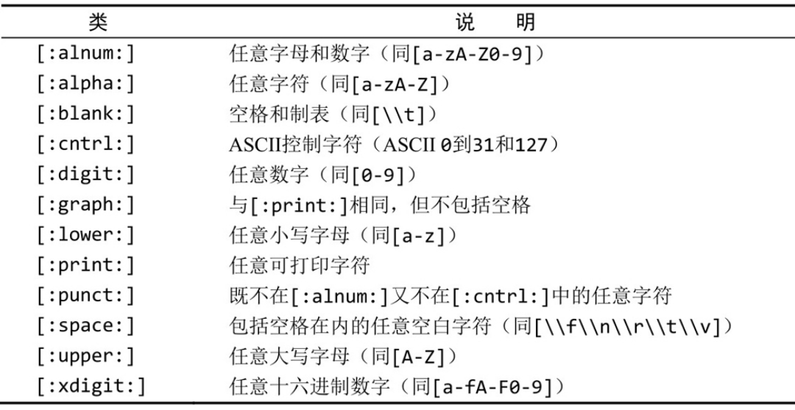
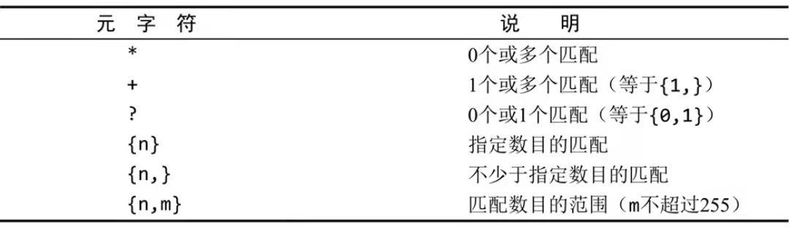
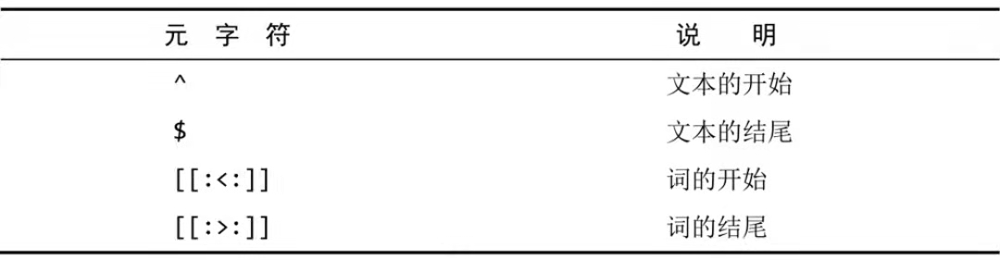
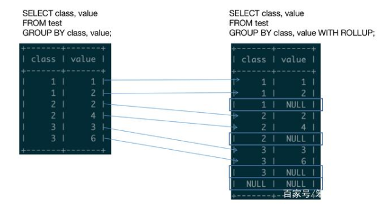
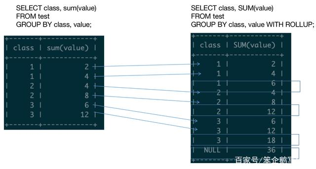
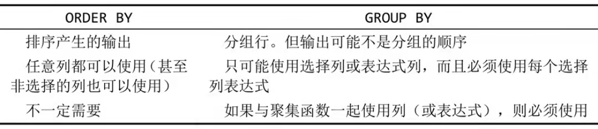
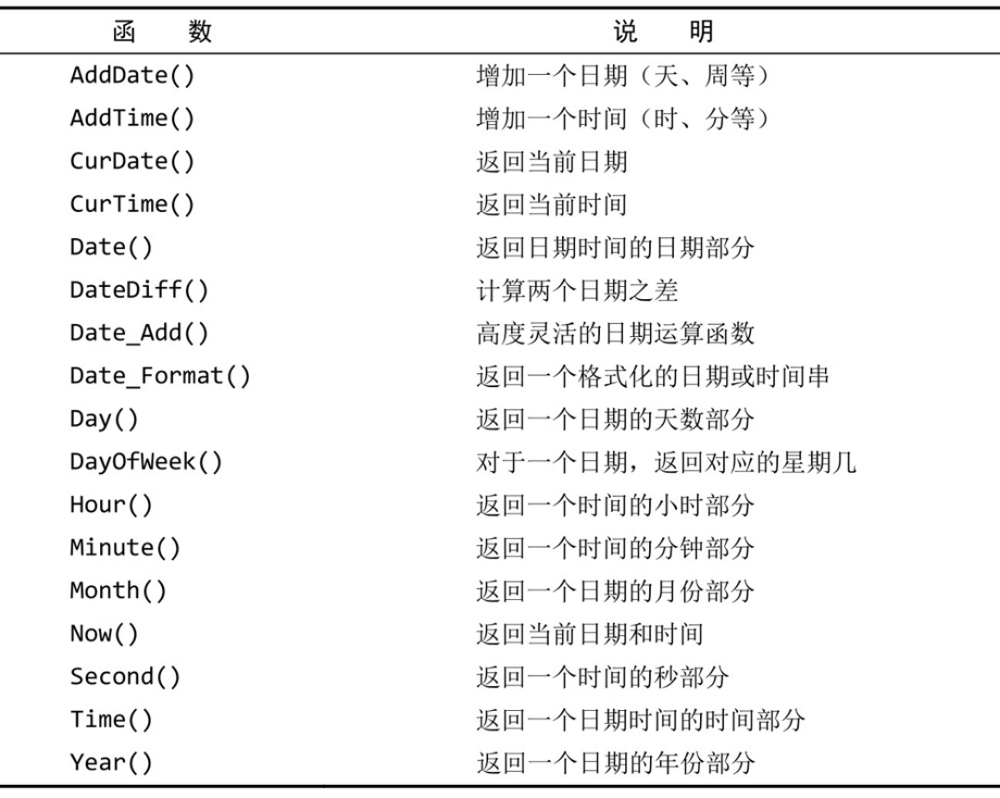
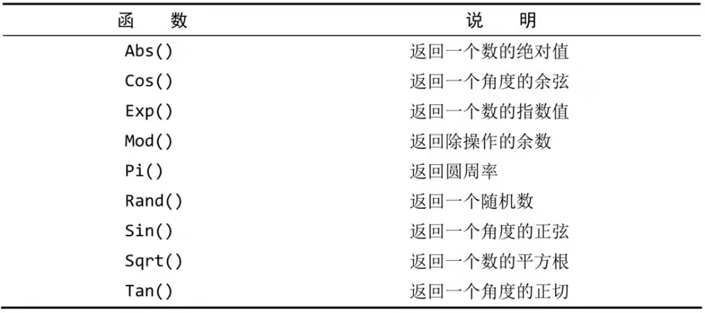
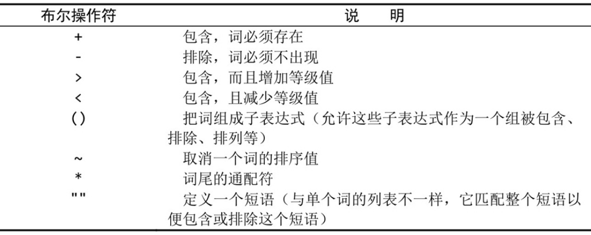

# 基本知识

## 命令

终端常用的命令

- show databases
  显示可用的数据库

- use database_name
  使用database_name数据库

- show tables
  展示该数据库中的表

- show columns from table_name
  展示表table-name中的列
  
- describe table_name
  展示表table-name中的列
  
- show status
  显示广泛的服务器状态信息
  
- show grants
  显示授予用户（所有用户或特定用户）的安全权限
  
- show errors
  显示服务器错误消息
  
- show warnings
  显示服务器警告消息
- show create database database_name
  显示创建特定数据库的MySQL语句
- show create table table_name
  显示创建特定表的MySQL语句

## 基本语法

### [SQL执行顺序](https://zhuanlan.zhihu.com/p/662951708)

```sql
(8) SELECT 
(9)DISTINCT<Select_list>
(1) FROM <left_table> 
(3) <join_type>JOIN<right_table>
(2) ON<join_condition>
(4) WHERE<where_condition>
(5) GROUP BY<group_by_list>
(6) WITH {CUBE|ROLLUP}
(7) HAVING<having_condtion>
(10) ORDER BY<order_by_list>
(11) LIMIT<limit_number>
```

1. `from`子句是执行的第一步，根据语句后的表进行查询，生成一个虚拟表作为数据源，如果`from`后跟了多个表，则进行笛卡尔积，执行顺序是从后往前，即最后的表作为基础表
1. `on`子句在`from`子句之后执行，对`from`子句产生的虚拟表进行过滤，并产生一张新的虚拟表
1. `join`子句在`on`子句之后执行，为`on`子句产生的虚拟表添加外部行，也就是联结表的数据，此时，会将`on`子句过滤掉的属于**保留表**的行重新添加回来。

### 创建表

```sql
create table customers if not exists
(
	cust_id int not null auto_increment,
	cust_name char(50) not null default 'jack', # 使用默认值，mysql不允许使用函数作为默认值
	cust_address char(50) null,
	primary key (cust_id)
) engine=innodb;
```

#### 主键

 `primary key(key1,key2...)` 

主键不允许为 `null` 。

 `auto_increment` 自动递增。每个表只能有一个自动递增的列，且该列必须被索引（如，通过使它成为主键）。
可覆盖，只要插入时插入一个唯一的、从未用过的值就可，接下来的自增值基于此值。

获取最后一个 `auto_increment` 的值

```sql
select last_insert_id();
```

#### 引擎

-  `InnoDB` 是一个可靠的事务处理引擎，不支持全文本搜索
-  `MEMORY` 功能上等同于 `MyISAM` ，它数据存储在内存中（而不是硬盘中）速度很快，适合建立临时表。
-  `MyISAM` 性能极高，支持全文本搜索，但是不支持事务处理。

***注意：外键不能跨引擎引用。*** 

### 修改表

#### 增加列

```sql
alter table vendors add  vend_phone char(20);
```


#### 删除列

```sql
alter table vendors drop column vend_phone;
```


#### 修改列

```sql
 alter table vendors modify vend_phone int; # 修改列定义
 alter table vendors change vend_phone vend_phone char(20); # 修改列名称和定义
```

修改列的是否非空或默认值时，要么把已有数据删除，要么新建一个表。不能在有数据的表中这样修改。

```sql
alter table student modify stu_phone int not null default 10; # 给列新增非空、默认值定义。

alter table student alter stu_phone set default 100; # 修改列默认值

alter table student alter stu_phone drop default; # 删除列默认值

 alter table student engine = MYISAM; # 修改表引擎
```

#### 修改约束

```sql
# 删除主键约束
alter table student drop primary key;
# 新增主键约束
alter table courses add constraint pk_id primary key(id);
# 新增外键约束----字段类型要一致
alter table courses add constraint fk_teacher_id foreign key(teacher_id) references teachers(id);
```


### 删除表

```sql
drop table customers;
```


### 重命名表

```sql
rename table student to students;
rename table table1 to t1,table2 to t2;
```

### 插入数据

#### 插入完整行

```sql
insert into customers values(null,'Pep E. LaPew','100 Main Street', 'Los Angeles','CA','90046','USA',null,null);
# cust_id 为null，这是因为每次插入新行，该列可由mysql自增，这里的null被mysql忽略，由mysql自动插入下一个可用的cust_id。如果我们不想赋值，但是又不能省略，就用null。
```

这种写法不安全，应该将列都标出。

#### 插入行的一部分

- 省略部分可以为 `null` 。
- 表定义时给出默认值。

#### 插入多行

```sql
insert into customers(cust_name,cust_address,cust_city,cust_state,cust_zip,cust_country) 
values ('M. Martian','42 Galaxy Way','New York','NY','11213','USA'),
('Pep E. LaPew','50 Main Street','Los Angeles','VA','90046','USA');
```

可以提高 `insert` 性能， `mysql` 使用单条 `insert` 处理多个插入比使用多条 `insert` 语句更快。

#### 插入查询结果

```sql
insert into customers(cust_id,cust_contact,cust_email,cust_address,cust_citycust_state,cust_zip,cust_country)
select cust_id,cust_contact,cust_email,cust_address,cust_citycust_state,cust_zip,cust_country from custnew;
```

***注意：不要求`insert` 和 `select` 列名相同，`mysql`使用的是列的位置去填充***。 

#### `select into from` 和 `insert into select`的区别

**`select into from`** ：将查询出来的数据整理到一张新表中保存，表结构与查询结构一致。

```sql
select *（查询出来的结果） into newtable（新的表名）from oldtable where （后续条件）
```

即，查询出来结果--->复制一张同结构的空表--->将数据拷贝进去。

**`insert into select`** ：为已经存在的表批量添加新数据。

```sql
insert into  (准备好的表) select *（或者取用自己想要的结构）from 表名 where 各种条件
```

即，指定一张想要插入数据的表格--->对数据进行加工筛选--->填入那张准备好的表格。

### 修改数据

#### 更新特定行

需要`where` 子句过滤。

 `update` 可以跟随 `select` 子查询，但是子查询查询的表不能是要更新的表。

```sql
update customers set cust_email = (select prod_name from products where prod_id = 'ANV01') where cust_id = 10005;
```

 `update join` 

```sql
update employees inner join merits on employees.performance = merits.performance set salary = salary + salary + percentage;
```

```sql
update employees e left join merits m on e.performance = m.performance set salary = salary + salary * 0.1 where m.percentage is null;
```

#### 更新所有行

#### 更新多个表

```sql
update products p,customers c set p.prod_name = 'xpf',c.cust_name = 'xpf' where p.prod_id = 'ANV01' and c.cust_id = 10005;
```

#### 注意

1. 更行多行，如果中间出错，会回退所有更改。如果想要跳过错误继续执行，使用 `ignore` 关键字

   ```sql
   update ignore customers ...
   ```

2. 若想删除某个列的值，可以通过设置其为 `null` 。

### 删除数据

```sql
delete from customers where cust_id = 10006;
```

删除所有行不要使用 `delete` ，使用 `truncate table` 语句更快。该语句实际上是删除原表并建立一个空表，而不是逐行删除。  

 `mysql` 无法删除与其他表有关联关系的行

## 常用关键字

###   `distinct` 

去掉结果中重复的值。

```sql
select distinct vend_id from products;
```

注意：

- 将 `Null` 值看作相同的值，如果列中有多个 `Null` ，只保留一个。

- 作用于多列，将其看作一个组合体对待。

  ```sql
  SELECT DISTINCT
      state, city
  FROM
      customers
  WHERE
      state IS NOT NULL
  ORDER BY state , city;
  ```

- 与 `group by` 的区别就是不可以排序，但是可以加入 `order by` 进行排序。

- 可以用于聚合函数中，在聚合函数起作用之前先去重。只能用在指定了列名的情况下，所以 `count(distinct *)` 报错，也不能用在计算或表达式中。

  ```sql
  SELECT 
      COUNT(DISTINCT state)
  FROM
      customers
  WHERE
      country = 'USA';
  ```

- 与 `limit` 组合时，在达到 `limit` 限制时立刻停止搜索。

### `limit` 

- 只有一个参数，表示返回的最大行数

  ```sql
  select prod_name from products limit 5;
  ```

- 两个参数，第一个表示第一行的偏移量，也就是从第几行开始，首行为0；第二个参数表示返回的最大行数

  ```sql
  select prod_name from products limit 3,4; # 从行3开始取4行结束
  ```

  也可以写成

  ```sql
  select prod_name from products limit 4 offset 3;
  ```

###  `order by` 

默认升序 `ASC` ，可以指定按降序排列 `DESC` 。

- 按单个列排序

  ```sql
  select prod_name from products order by prod_name;
  ```

- 按多个列排序

  ```sql
  select prod_id,prod_name,prod_price from products order by prod_price , prod_name; # 先按价格排序，然后相同的价格之间按名称排序
  ```

- 按表达式进行排序

  ```sql
  select prod_id,prod_name,prod_price*0.5 from products order by prod_price*0.5 desc;
  ```

- 根据 `field()` 自定义排序

  ```sql
  select prod_id,prod_name,prod_price from products order by field(prod_price,'55','2.5','50','3.42','10');
  +---------+----------------+------------+
  | prod_id | prod_name      | prod_price |
  +---------+----------------+------------+
  | ANV01   | .5 ton anvil   |       5.99 |
  | ANV02   | 1 ton anvil    |       9.99 |
  | ANV03   | 2 ton anvil    |      14.99 |
  | DTNTR   | Detonator      |      13.00 |
  | JP1000  | JetPack 1000   |      35.00 |
  | OL1     | Oil can        |       8.99 |
  | SLING   | Sling          |       4.49 |
  | JP2000  | JetPack 2000   |      55.00 |
  | FC      | Carrots        |       2.50 |
  | TNT1    | TNT (1 stick)  |       2.50 |
  | SAFE    | Safe           |      50.00 |
  | FU1     | Fuses          |       3.42 |
  | FB      | Bird seed      |      10.00 |
  | TNT2    | TNT (5 sticks) |      10.00 |
  +---------+----------------+------------+
  # 先将field()中所包含的数据按自定义顺序排序，未包含的值随机输出，并放在前面，随后输出field()中包含的排好序的数据
  ```

- 配合 `limit` 输出想要的序列，比如最大值、最小值等


###  `is null` 

- 检查具有 `null` 值的列。

  ```sql
  select cust_id from customers where cust_email is null;
  ```

###  `in` 

- 后跟 `()` ，查询括号范围中的数据。

  ```sql
  select prod_name,prod_price,vend_id from products where vend_id in (1002,1003);
  ```

注意：

-  `in` 在使用长的合法选项清单时更为清晰直观
-  由于使用的操作符更少，计算次序更容易管理
-  执行速度相较于 `or` 更快
-  可以包含其他 `select` 语句，使得能够更加动态地建立 `where` 子句

###  `not` 

否定之后紧跟的条件。

```sql
select prod_name,prod_price from products where vend_id not in (1002,1003) order by prod_name;
```

###  `like` 

- `%` 任何字符出现任意次数，无法匹配 `null` 

  ```sql
  select prod_id,prod_name from products where prod_name like 'jet%';
  +---------+--------------+
  | prod_id | prod_name    |
  +---------+--------------+
  | JP1000  | JetPack 1000 |
  | JP2000  | JetPack 2000 |
  +---------+--------------+
  ```

- `_` 匹配单个字符

  ```sql
  select prod_id,prod_name from products where prod_name like '_ ton anvil';
  ```

注意：不要过多使用通配符，搜索速度会降低

- 有能够达到相同效果的，应该不使用通配符

- 确实使用通配符，不要将其用在搜索模式开始处（匹配表达式最左侧）

  ```sql
  select prod_id,prod_name from products where prod_name like '_ ton anvil'; # 不该放在开头
  ```

### 正则表达式（ `regexp` ）

- ```sql
  select prod_name from products where prod_name regexp '1000' order by prod_name;
  +--------------+
  | prod_name    |
  +--------------+
  | JetPack 1000 |
  +--------------+
  ```

- ```sql
  select prod_name from products where prod_name regexp '.000' order by prod_name;
  +--------------+
  | prod_name    |
  +--------------+
  | JetPack 1000 |
  | JetPack 2000 |
  +--------------+
  ```

- ```sql
  select prod_name from products where prod_name regexp '1000|2000' order by prod_name;
  +--------------+
  | prod_name    |
  +--------------+
  | JetPack 1000 |
  | JetPack 2000 |
  +--------------+
  ```

- 匹配特定字符 `[]` 

  ```sql
  select prod_name from products where prod_name regexp '[123] Ton' order by prod_name;
  +-------------+
  | prod_name   |
  +-------------+
  | 1 ton anvil |
  | 2 ton anvil |
  +-------------+
  ```

- 否定字符集 `[^]` 

  ```sql
  select prod_name from products where prod_name regexp '[^123] Ton' order by prod_name;
  +--------------+
  | prod_name    |
  +--------------+
  | .5 ton anvil |
  +--------------+
  ```

- 范围匹配 `[1-5]` 

  ```sql
  select prod_name from products where prod_name regexp '[1-5] Ton' order by prod_name;
  +--------------+
  | prod_name    |
  +--------------+
  | .5 ton anvil |
  | 1 ton anvil  |
  | 2 ton anvil  |
  +--------------+
  ```

- 匹配特殊字符，需要转义 `\\` 

  ```sql
  select vend_name from vendors where vend_name regexp '\\.' order by vend_name;
  +--------------+
  | vend_name    |
  +--------------+
  | Furball Inc. |
  +--------------+
  ```

- 
   

  ```sql
  select prod_name from products where prod_name regexp '[:digit:] Ton' order by prod_name;
  +--------------+
  | prod_name    |
  +--------------+
  | .5 ton anvil |
  | 1 ton anvil  |
  | 2 ton anvil  |
  +--------------+
  ```

- 
   

  ```sql
  select prod_name from products where prod_name regexp '\\([0-9] sticks?\\)' order by prod_name;
  +----------------+
  | prod_name      |
  +----------------+
  | TNT (1 stick)  |
  | TNT (5 sticks) |
  +----------------+
  ```

- 
   

  ```sql
  select prod_name from products where prod_name regexp '^[[:digit:]\\.]';
  +--------------+
  | prod_name    |
  +--------------+
  | .5 ton anvil |
  | 1 ton anvil  |
  | 2 ton anvil  |
  +--------------+
  ```

- 正则表达式测试，`regexp` 返回0（没有匹配）1（匹配）

  ```sql
  select 'hello' regexp '[0-9]';
  +------------------------+
  | 'hello' regexp '[0-9]' |
  +------------------------+
  |                      0 |
  +------------------------+
  ```

- 如果不加通配符， `like` 表示精确匹配，等同于 `=` ，而 `regexp` 则是模糊匹配。

###  `group by` 

```sql
select vend_id,count(*) num_prods from products group by vend_id;
```

注意：

1. `group by` 后列数不限，可以形成嵌套。

2. `group by` 子句中嵌套了分组，数据将在最后规定的分组上进行汇总。也就是说，指定的列都一起计算，不能从个别的列取回数据。

3. `group by` 子句中每列都必须是检索列或者有效的表达式（不能是聚集函数）。假如在 `select` 中使用表达式， `group by` 中必须指定相同的表达式。可以识别别名。

   ```sql
   select vend_id as id ,count(*) num_prods from products group by id;
   ```

4. `select` 中每个列都必须在 `group by` 中给出，除了聚集函数，反之，`group by`子句中的每一列不是必须在`select`子句中出现。

5. 对于 `null` ， `group by` 将其视作同一组。

6. `with rollup` 对分组后的数据每一组进行汇总并返回。此函数是对聚合函数进行求和，注意 `with rollup`是对 group by 后的第一个字段，进行分组求和。
   
    

上图左侧部分箭头所指右侧部分的数据是对应的，右侧部分方框中的数据是对上面该组数据的汇总，由于没有使用聚合函数，所以用NULL表示，最后一个是对所测所有查询结果的汇总。

 

有时 `group by` 关闭了ONLY_FULL_GROUP_BY模式后可以不要求检索列必须在分组中，这时，查询出来的不在分组中的其他需要被检索出来的列默认选择第一行。

### `having` 

支持所有 `where` 操作符。但是 `where` 在数据分组前进行过滤， `having` 在数据分组后进行过滤。

```sql
select vend_id, count(*) as num from products where prod_price  >= 10 group by vend_id having count(*) >= 2; # 过滤出拥有至少两种价格在10以上的商品的生产商
```

与 `order by` 区别

 

```sql
select sum(quantity*item_price) as ordertotal,order_num from orderitems group by order_num having sum(quantity*item_price) >= 50 order by ordertotal;
+------------+-----------+
| ordertotal | order_num |
+------------+-----------+
|      55.00 |     20006 |
|     125.00 |     20008 |
|     149.87 |     20005 |
|    1000.00 |     20007 |
+------------+-----------+
# 查询总计订单的价格在50以上的订单的订单号和总计的订单价格，按订单价格排序
```

### exists

对主查询语句执行一个循环，将主语句每一条结果作为子查询条件，如果子查询有返回结果，则为true，否则为false。

子查询受限制，不允许有`compute`子句和`into`关键字。

```sql
SELECT c.CustomerId,CompanyName FROM Customers c
WHERE EXISTS(
SELECT OrderID FROM Orders o WHERE o.CustomerID=c.CustomerID)
```

当在子查询中使用 `NULL` 时，仍然返回结果集

```sql
select * from tableIn where exists(select null);
# 等同于
select * from tableIn;
```

**EXISTS执行顺序：**

1、首先执行一次外部查询，并缓存结果集，如 `SELECT * FROM A`

2、遍历外部查询结果集的每一行记录`R`，代入子查询中作为条件进行查询，如 `SELECT 1 FROM B WHERE B.id = A.id`

3、如果子查询有返回结果，则`EXISTS`子句返回TRUE，这一行`R`可作为外部查询的结果行，否则不能作为结果

## 条件符号

```
=  等于
<> 不等于
!= 不等于
< 小于
<= 小于等于
> 大于
>= 大于等于
between and 在指定的两个值之间（包括两端）
```

## 常用函数

***函数的可移植性不强，注意使用，以及做好注释***。

### 文本处理函数

####  `concat()` 

```sql
select concat(vend_name,'(',vend_country,')') from vendors order by vend_name;
+----------------------------------------+
| concat(vend_name,'(',vend_country,')') |
+----------------------------------------+
| ACME(USA)                              |
| Anvils R Us(USA)                       |
| Furball Inc.(USA)                      |
| Jet Set(England)                       |
| Jouets Et Ours(France)                 |
| LT Supplies(USA)                       |
+----------------------------------------+
```

####  `rtrim()`  `ltrim()` `trim()` 

去掉空格。

```sql
select concat(rtrim(vend_name),' (',rtrim(vend_country),')') from vendors order by vend_name;
```

####  `upper()` 

转为大写。

```sql
select vend_name,upper(vend_name) as vend_name_upper from vendors order by vend_name;
```

####  `lower()`

转为小写。

```sql
 select vend_name,lower(vend_name) as vend_name_upper from vendors order by vend_name;
```

####  `left(str,length)` 

将 `str` 从左返回指定的长度 `length` 。

```sql
 select vend_name,left(vend_name,3) as vend_name_upper from vendors order by vend_name;
```

####  `right(str,length)`

将 `str` 从右返回指定的长度 `length` 。

####  `length(str)`

返回 `str` 的长度。

```sql
select vend_name,length(vend_name) as vend_name_upper from vendors order by vend_name;
```

####  `locate(substr,str)` `locate(substr,str,pos)` 

返回 `substr` 子串在 `str` 中首次出现的位置（首位为1）， `pos` 表示从第几位开始查。

```sql
select locate('bar','foobarbar');
+---------------------------+
| locate('bar','foobarbar') |
+---------------------------+
|                         4 |
+---------------------------+
select locate('bar','foobarbar',5);
+-----------------------------+
| locate('bar','foobarbar',5) |
+-----------------------------+
|                           7 |
+-----------------------------+
```

####  `substring()/substr()` 

- `substring(str,pos)`  `substring(str from pos)` 从位置 `pos` 开始截取，开始位置为1。

  ```sql
   select substring('Quadratically',5);
   select substring('Quadratically' from 5);
  +-----------------------------------+
  | ratically                         |
  +-----------------------------------+
  ```

- `substring(str,pos,len)`  `substring(str from pos for len)` 从位置 `pos` 开始截取长度为 `len` 的字符串，开始位置为1。

  ```sql
  select substring('Quadratically',5,3);
  select substring('Quadratically'from 5 for 3);
  +----------------------------------------+
  | rat                                    |
  +----------------------------------------+
  ```

####  `soundex()` 

匹配发音相似的列值。

```sql
select cust_name,cust_contact from customers where cust_contact = 'Y. Lie';
Empty set
select cust_name,cust_contact from customers where soundex(cust_contact) = soundex('Y. Lie');
+-------------+--------------+
| cust_name   | cust_contact |
+-------------+--------------+
| Coyote Inc. | Y Lee        |
+-------------+--------------+
```

### 日期和时间处理函数

格式： `yyyy-mm-dd` 

 

查询日期位2005年9月1日的订单

```sql
select cust_id,order_num from orders where order_date = '2005-09-01';
+---------+-----------+
| cust_id | order_num |
+---------+-----------+
|   10001 |     20005 |
+---------+-----------+
```

建议写成：

```sql
select cust_id,order_num from orders where date(order_date) = '2005-09-01';
+---------+-----------+
| cust_id | order_num |
+---------+-----------+
|   10001 |     20005 |
+---------+-----------+
```

查询2005年9月所有订单

```sql
select cust_id,order_num from orders where Date(order_date) between '2005-09-01' and '2005-09-30';
+---------+-----------+
| cust_id | order_num |
+---------+-----------+
|   10001 |     20005 |
|   10003 |     20006 |
|   10004 |     20007 |
+---------+-----------+
```

还可以写成：

```sql
select cust_id,order_num from orders where year(order_date) = '2005' and month(order_date) = '9';
+---------+-----------+
| cust_id | order_num |
+---------+-----------+
|   10001 |     20005 |
|   10003 |     20006 |
|   10004 |     20007 |
+---------+-----------+
```

### 数值处理函数


 

### 聚集函数

通过标准的算术操作符，聚集函数可以用来执行多个列上的计算。（例如两列相乘后对该列值求和），指定列名时，默认是 `all` 也可改为 `distinct` 。当聚集函数和非聚集函数（或字段）一起使用时，需要用到 `group by` 

######  `avg()` 

- 只能用于单个列，如需多个列的平均值，每个列都要使用该函数。

  ```sql
  select avg(prod_price) avg_price from products;
  ```

- 结合 `distinct` 获取不同值的平均值

  ```sql
  SELECT AVG(DISTINCT buyprice) FROM products;
  ```

- 结合 `group by` 使用，查询每组值的平均值。

  ```sql
  select vend_id,avg(prod_price) from products group by vend_id;
  ```

- 结合 `having` 在分组中过滤

  ```sql
  select vend_id,avg(prod_price) from products group by vend_id having avg(prod_price) >10;
  ```

######  `count()` 

- 对表中行数进行计数

  ```sql
  select count(*) as num_cust from customers;
  ```

- 对某一列进行计数，此时会忽略 `null` 值

  ```sql
  select count(cust_email) as num_cust from customers;
  ```

######  `max()` 

返回指定列中的最大值。数值或者日期返回最大值，文本值返回字符串比较方式的最大值。忽略 `null` 值。

```sql
select max(prod_price) as max_price from  products;
```

######  `min()` 

与 `max` 相反

######  `sum()` 

忽略 `null` 值。

- 返回指定列值的和

  ```sql
  select sum(quantity) as items_ordered from orderitems where order_num = 20005;
  ```

- 可以用来对计算值求和

  ```sql
  select sum(item_price*quantity) as total_price from orderitems where order_num = 20005;
  ```

 `select` 语句可以跟随多个聚集函数

```sql
select count(*) num_items,
min(prod_price) price_min,
max(prod_price) price_max,
avg(prod_price) price_avg
from products;
+-----------+-----------+-----------+-----------+
| num_items | price_min | price_max | price_avg |
+-----------+-----------+-----------+-----------+
|        14 |      2.50 |     55.00 | 16.133571 |
+-----------+-----------+-----------+-----------+
```

### 其他函数

#### `ifnull(expression,param2)`  

接受两个参数，如果不是`NULL`，则返回第一个参数。 否则，`IFNULL`函数返回第二个参数。两个参数可以是文字值或表达式。

应避免在[WHERE](http://www.yiibai.com/mysql/where.html)子句中使用`IFNULL`函数，因为它会降低查询的性能。如果要检查值是否为`NULL`，则可以在`WHERE`子句中使用`IS NULL`或`IS NOT NULL`。

#### `if(value, t, f)`

如果value为false，则返回t，否则返回f

#### `case when val1 then res1 else default end`

如果val1为true，则返回res1，否则返回default，可以有多个`when...then...`语句

#### `case expr when val1 then res1 else default end`

如果expr的值为val1，则返回res1，否则返回default，可以有多个`when...then...`语句

#### `coalesce(value,...)`

返回值列表中第一个非null的值，如果都为null，则返回null

## 约束

作用于表上字段的规则，用于限制存储在表中的数据，期望保证数据的正确性、有效性、完整性。

### 分类

#### 非空约束

限制该字段数据不能为NULL

```sql
NOT NULL;
```


#### 唯一约束

保证该字段的所有数据都是唯一、不重复的

```sql
UNIQUE
```

#### 主键约束

主键是一行数据的唯一标识，要求非空且唯一

```sql
PRIMARY KEY
```

#### 默认约束

保存数据时，如果数据未指定该字段值，则采用默认值

```sql
DEFAULT
```

#### 检查约束

*8.0.16版本之后添加*

保证字段值满足某一个条件

```sql
CHECK
```

#### 外键约束

用来让两张表的数据之间建立联系，保证数据的一致性和完整性。

```sql
FOREIGN KEY
```


## 查询

### 子查询

- 用在 `where` 子句进行过滤

  ```sql
  select cust_id from orders where order_num in (select order_num from orderitems where prod_id = 'TNT2');
  +---------+
  | cust_id |
  +---------+
  |   10001 |
  |   10004 |
  +---------+
  ```

- 用在 `select` 做相关子查询

  ```sql
  select cust_name,cust_state,(select count(*) from orders where orders.cust_id = customers.cust_id) as orders
  from customers
  order by cust_name;
  +----------------+------------+--------+
  | cust_name      | cust_state | orders |
  +----------------+------------+--------+
  | Coyote Inc.    | MI         |      2 |
  | E Fudd         | IL         |      1 |
  | Mouse House    | OH         |      0 |
  | Wascals        | IN         |      1 |
  | Yosemite Place | AZ         |      1 |
  +----------------+------------+--------+
  ```

验证子查询的正确性，可以从内而外一层层检查，并将结果直接替代子查询语句。

### 联结查询

联结是一种笛卡尔积。

#### 等值联结（内部联结）

```sql
select vend_name,prod_name,prod_price from vendors,products where vendors.vend_id = products.vend_id order by vend_name,prod_name;
+-------------+----------------+------------+
| vend_name   | prod_name      | prod_price |
+-------------+----------------+------------+
| ACME        | Bird seed      |      10.00 |
| ACME        | Carrots        |       2.50 |
| ACME        | Detonator      |      13.00 |
| ACME        | Safe           |      50.00 |
| ACME        | Sling          |       4.49 |
| ACME        | TNT (1 stick)  |       2.50 |
| ACME        | TNT (5 sticks) |      10.00 |
| Anvils R Us | .5 ton anvil   |       5.99 |
| Anvils R Us | 1 ton anvil    |       9.99 |
| Anvils R Us | 2 ton anvil    |      14.99 |
| Jet Set     | JetPack 1000   |      35.00 |
| Jet Set     | JetPack 2000   |      55.00 |
| LT Supplies | Fuses          |       3.42 |
| LT Supplies | Oil can        |       8.99 |
+-------------+----------------+------------+
```

或写为：

```sql
select vend_name,prod_name,prod_price from vendors inner join products on vendors.vend_id = products.vend_id order by vend_name,prod_name;
```

#### 自联结

```sql
select prod_id,prod_name from products where vend_id in (select vend_id from products where prod_id = 'DTNTR'); # 使用子查询


select p1.prod_id ,p1.prod_name from products p1,products p2 where p1.vend_id = p2.vend_id and p2.prod_id = 'DTNTR'; # 使用自联结
+---------+----------------+
| prod_id | prod_name      |
+---------+----------------+
| DTNTR   | Detonator      |
| FB      | Bird seed      |
| FC      | Carrots        |
| SAFE    | Safe           |
| SLING   | Sling          |
| TNT1    | TNT (1 stick)  |
| TNT2    | TNT (5 sticks) |
+---------+----------------+
```

#### 自然联结

在内部联结（等值联结）的基础上，剔除相同的列。

```sql
select c.*,o.order_num,o.order_date,oi.prod_id,oi.quantity,oi.item_price from customers c,orders o,orderitems oi where c.cust_id = o.cust_id and o.order_num = oi.order_num and prod_id = 'FB';
```

#### 外部联结

  ***`mysql` 不支持完全的外部联结，只有左外部联结或者右外部联结。*** 

```sql
select c.cust_id, o.order_num from customers c left outer join orders o on c.cust_id = o.cust_id;
+---------+-----------+
| cust_id | order_num |
+---------+-----------+
|   10001 |     20005 |
|   10001 |     20009 |
|   10002 |      NULL |
|   10003 |     20006 |
|   10004 |     20007 |
|   10005 |     20008 |
+---------+-----------+
```

```sql
select c.cust_id, o.order_num from customers c right outer join orders o on c.cust_id = o.cust_id;
+---------+-----------+
| cust_id | order_num |
+---------+-----------+
|   10001 |     20005 |
|   10003 |     20006 |
|   10004 |     20007 |
|   10005 |     20008 |
|   10001 |     20009 |
+---------+-----------+
```

#### 聚集函数配合联结

```sql
select c.cust_name,c.cust_id ,count(o.order_num) as num from customers c left join orders o on c.cust_id = o.cust_id group by c.cust_id;
```

### 组合查询

什么时候使用组合查询：

- 单个查询中从不同的表返回相似结构的数据
- 对单个表执行多个查询，按单个查询返回数据

使用规则：

- 由至少两条 `select` 语句构成，语句之间使用 `union` 相连。
- 每个查询所包含的列，表达式，聚集函数必须相同，位置最好也相同（位置不同，虽能查出结果，但是两条语句属性没对应上——名字对应上了价格，价格对应上了名字）
- 每一列的数据类型必须兼容，不需要完全相同，但必须时 `DBMS` 可以隐含转换的类型（例如不同的数据类型，或者不同的日期类型等）

####  `union` 

会取消重复行。

```sql
select prod_id,prod_name,prod_price from products where vend_id in (1001,1002) union select prod_id,prod_name,prod_price from products where prod_price <= 5 order by prod_price;
```

####  `union all`

不取消重复行。

#### 排序

**只能在最后一条查询语句之后使用 `order by`** ，该排序对整个组合查询生效。无法单独只排列某一个。

### 全文本搜索

 `MyISAM` 引擎支持全文本搜索， `InnoDB` 引擎不支持。

在创建表时启用全文本搜索

```sql
CREATE TABLE `productnotes` (
  `note_id` int NOT NULL AUTO_INCREMENT,
  `prod_id` char(10) NOT NULL,
  `note_date` datetime NOT NULL,
  `note_text` text,
  PRIMARY KEY (`note_id`),
  FULLTEXT(`note_text`) # 给出被索引列的一个逗号分隔的列表
) ENGINE=MyISAM
```

  ***注意：不要再导入数据时使用 `fulltext` ，应该导完后修改表*** 

#### 使用全文本搜索

除非使用 `BINARY` 方式，否则不区分大小写。

-  `match()` 指定被搜索的列。传递给该函数的值必须与 `fulltext` 中定义的相同。如果有多个列，必须列出他们，次序正确。
-  `against()` 指定要使用的搜索表达式

```sql
select note_text from productnotes where match(note_text) against('customer,rabbit');
```

```sql
select note_text from productnotes where match(note_text) against('rabbit'); # 找出note_text列中包括rabbit值的所有值
```

搜索结果有排序，较高等级先返回（匹配度越高）

```sql
select note_text,match(note_text) against('rabbit') as pipeidu from productnotes; # 返回每一列，和每一列的匹配度
```

一般匹配词靠前的匹配度比较高。

#### 带扩展的全文本查询

根据一个匹配条件进行基本的全文本搜索，然后 `mysql` 基于结果，判定出结果中所有有用的词，然后根据初始匹配条件和这些有用的词进行第二次全文本搜索。 `with query expansion` 。

```sql
select note_text from productnotes where match(note_text) against('anvils');
----------------------
note_text
--------------------
Multiple customer returns, anvils failing to drop fast enough or falling backwards on purchaser. Recommend that customer considers using heavier anvils. 
```

```sql
select note_text from productnotes where match(note_text) against('anvils' with query expansion);
-----------------------------------------------------------
note_text                                                     
-------------------------------------------------------------
Multiple customer returns, anvils failing to drop fast enough or falling backwards on purchaser. Recommend that customer considers using heavier anvils. 
---------------------------------------------
Customer complaint:
Sticks not individually wrapped, too easy to mistakenly detonate all at once.
Recommend individual wrapping.                        
---------------------------------------------
Customer complaint:
Not heavy enough to generate flying stars around head of victim. If being purchased for dropping, recommend ANV02 or ANV03 instead.  
---------------------------------------------
Please note that no returns will be accepted if safe opened using explosives.                                             
---------------------------------------------
Customer complaint: rabbit has been able to detect trap, food apparently less effective now.                           
-----------------------------------------
Customer complaint:
Circular hole in safe floor can apparently be easily cut with handsaw.                                                     ---------------------------------------------
Matches not included, recommend purchase of matches or detonator (item DTNTR).
```

#### 布尔文本搜索

1. 要匹配的值
2. 要排斥的值（只要包含该值，则不返回该行）
3. 排列提示（指定匹配的值的权重，权重越大等级越高）
4. 表达式分组
5. 如果没有 `fulltext` 索引也可以使用，但是性能随数据量增大而降低

```sql
select note_text from productnotes where match(note_text) against('heavy' in boolean mode); # 包含heavy
```

```sql
select note_text from productnotes where match(note_text) against('heavy -rope*' in boolean mode); # 包含heavy 除去以rope开头的
```




#### 注意：

- `MySQL`全文搜索引擎中定义的搜索项的最小长度为`4`，这意味着如果搜索长度小于`4`的关键字，例如`car`，`cat`等，则不会得到任何结果。
- 停止词被忽略，`MySQL` 定义了`MySQL`源代码分发`storage/myisam/ft_static.c`中的停止词列表。（ `stopword` 列表 ）
- `mysql` 规定如果一个词出现在50%以上的行中，则将其作为一个非用词忽略。不适用于 `in boolean mode` 。
- 表中行少于3行，全文本搜索不返回结果（因为每个词要么不出现，要么至少出现在50%的行中）
- 忽略词中的单引号（ `don't` 索引为 `dont` ）
- 不具有词分隔符（包括日语和汉语，这类似于英文单词中的空格）的语言不能恰当的返回全文本搜索结果。
- 只在 `MyISAM` 引擎中支持全文本搜索。


## 视图

​	视图是虚拟的表，与普通包含数据的表不同，视图只包含使用时动态检索数据的查询。当视图中的 `sql` 联结表过多，或嵌套了视图，会造成性能下降。

### 好处：

- 复用 `sql` 
- 简化复杂的 `sql` 操作，隐藏某些复杂查询的具体细节。
- 使用表的组成部分而不是整个表
- 保护数据。通过向用户授予访问表特定部分的权限。
- 更改数据格式和表示。视图可以返回与底层表的表示和格式不同的数据。

### 规则和限制

- 视图命名必须唯一
- 创建视图没有数目限制
- 创建视图必须具有足够的访问权限
- 视图可以嵌套
- `order by` 可以用在视图中，但是如果在查询视图的语句中也使用了 `order by` ，怎会覆盖视图自带的
- 视图不能索引，也不能有关联的触发器或默认值
- 可以和表一起使用，例如联结

### 语句

- 创建视图

  ```sql
  create view;
  
  create view productcustomers as select cust_name,cust_contact,prod_id from customers,orders,orderitems where customers.cust_id = orders.cust_id and orderitems.order_num = orders.order_num;
  ```

- 删除视图

  ```sql
  drop view view_name;
  ```

- 更改视图

  ```sql
  # 先删除后创建
  drop view view_name;
  create view
  # 直接使用
  create or replace view
  ```

- 查看创建视图的语句

  ```sql
  show create view view_name;
  ```

### 更新视图并更新表

通常视图是可更新的，（即可以对其使用 `insert update delete` 语句），更新视图将更新表。

如果 `mysql` 不能正确地确定被更新的基数据，则不允许更新。即视图中使用以下语句，如：

- 分组（使用 `group by` 和 `having` ）
- 联结（`join` ）
- 子查询
- 并（`union` ）
- 聚集函数（`min() count() sum()` ）
- `distinct` 
- 导出列（计算列）


## 存储过程（实际是一种函数）

优点：

- 将多条 `sql` 封装在一起，简化复杂操作
- `sql` 逻辑顺序是相同的，使用存储过程可以防止出错，保证了数据的完整性
- 如需改动只需改动存储过程的代码，对外隐藏变动，提供了安全性
- 使用存储过程比使用单独的 `sql` 要快，可以提高性能

缺点：

- 编写复杂
- 需要权限去创建

### 创建

```sql
create procedure productpricing()
begin
	select avg(prod_price) as priceaverage from products;
end;
```

注意：

当使用 `MySQL` 命令窗口创建时，由于分隔符 `;` 的原因会报错，此时应该临时更改默认分隔符。

```sql
delimiter //
create procedure productpricing()
begin
   select avg(prod_price) as priceaverage from products;
end //
delimiter ;
```

### 使用变量

```sql
create procedure producepricing(
	out p1 decimal(8,2),
	out p2 decimal(8,2),
    out p3 decimal(8,2)
)
begin
   select min(prod_price) into p1 from products;
   select max(prod_price) into p2 from products;
   select avg(prod_price) into p3 from products;
end;

call producepricing(@pl,@ph,@pa); # 调用

select @pl;      # 查看
select @pl,@lh,@pa;
```

### 传入参数

```sql
create procedure ordertotal(
   in onumber int,
   out ototal decimal(8,2)
)
begin
   select sum(item_price*quantity) from orderitems where order_num = onumber into ototal;
end;

call ordertotal(20005,@total); # 调用存储过程，传入20005
select @total; # 查询返回的20005的订单总数
```

### 更强大的创建

```sql
create procedure ordertotal(
   in onumber int,
   in taxable boolean, #输入Boolean类型（非 0 即为真， 0 为假）
   out ototal decimal(8,2)
) comment 'Obtain'  # 将在 show procedure status 中展示
begin
  declare total decimal(8,2); # 定义变量，需要给出类型
  declare taxrate int default 6;  # 给出了默认值 6
  select sum(item_price*quantity) from orderitems where order_num = onumber into total;
  if taxable then # if条件控制语句
    select total + (total/100*taxrate) into total;
  end if;
  select total into ototal;
end ;


call ordertotal(20005,0,@total);
select @total;
+--------+
| @total |
+--------+
| 149.87 |
+--------+

call ordertotal(20005,1,@total);
select @total;
+--------+
| @total |
+--------+
| 158.86 |
+--------+
```

### 调用

```sql
call productpricing();
```

### 删除

```sql
drop procedure productpricing;
drop procedure if exists productpricing;
```

### 检查

查看建立一个存储过程的创建语句

```sql
show create procedure 名字;
```

获取存储过程详细信息，包括何时和人等

```sql
show procedure status; # 展示所有存储过程
show procedure status like 'ordertotal'; # 进行过滤
```

## 游标（cursor）

是一个存储在 `MySQL` 服务器上的数据库查询，它不是一条 `select` 语句，而是被该语句检索出来的**结果集**。主要用于交互式应用，其中用户需要滚动屏幕上的数据，并对数据进行浏览或做出更改。在 `MySQL` 中只能用于存储过程（和函数）。先声明（declare）然后打开（open）最后关闭（close），声明之后可以多次打开或者关闭。

### 为什么使用游标：

- 需要在检索出来的行中前进或者后退一行或多行。

### 使用游标

- 声明游标

  ```sql
  create procedure processorders()
  begin
  	declare ordernumbers cursor for select order_num fro orders;
  end;
  ```

- 打开游标

  ```sql
  open ordernumbers;
  ```

- 关闭游标

  ```sql
  # 释放游标使用的所有内部内存和资源，如果没有显示关闭，MySQL会隐式的关闭游标，即在到达end语句时自动关闭。
  close ordernumbers;
  ```

- 检索每一行

  ```sql
  create procedure processorders()
  begin
  -- 定义变量
     declare done boolean default 0;
     declare o int;
     declare t decimal(8,2);
  -- 定义游标
     declare ordernumbers cursor for select order_num from orders;
  -- 定义句柄
     declare continue handler for sqlstate '02000' set done = 1;
  -- 创建表
     create table if not exists ordertotals
     (order_num int,total decimal(8,2));
  -- 打开游标
     open ordernumbers;
  -- 循环
     repeat
     	  fetch ordernumbers into o;
        call ordertotal(o,1,t);
        insert into ordertotals(order_num,total) values(o,t);
     until done end repeat;
  -- 关闭游标
     close ordernumbers;
  end;
  
  call processorders(); # 不返回数据，生成一个表
  select * from ordertotals; # 查询数据。
  +-----------+---------+
  | order_num | total   |
  +-----------+---------+
  |     20005 |  158.86 |
  |     20006 |   58.30 |
  |     20007 | 1060.00 |
  |     20008 |  132.50 |
  |     20009 |   40.78 |
  |     20009 |   40.78 |
  +-----------+---------+
  ```

## [触发器](./mysql触发器.md)

在 `MySQL` 相应 `delete insert update` 语句时，自动执行的一条 `sql` 语句。

`MySQL8`  不允许触发器有返回结果。

### 创建触发器

```sql
create trigger newproduct after insert on products for each row select 'product added' into @p;
-- 将返回结果存储在变量中
```

## *编程习惯

1. 设立主键的好习惯

   ```
   1.不更新主键列中的值
   2.不重（chong）用主键列的值
   3.不在主键列中使用可能会更改的值
   ```

2. 检索时使用通配符 `*` 会降低检索和应用程序的性能。

3. 字符串用单引号，数值不用引号

4. `in` 执行速度相较于 `or` 更快

5. 日期中年份总是使用4位表示更准确，这样 `MySQL` 不用进行任何假设

6. 虽然子查询使得查询的功能更强、更灵活，但是基于性能的考虑，不要过多嵌套子查询。

7. 不要联结过多的表，表越多，查询性能越低。

8. 多表查可以使用表别名，可以缩短语句长度。

9. 自联结与子查询，有时自联结速度比子查询要快很多，所以使用时应该都尝试一下。

10. 在使用联结时，应该总是提供正确的联结条件，不然回返回笛卡尔积数据，联结条件错误则会返回错误的数据。

11. 在使用多表联结时，应该总是测试语句，分开测试比较有效简单。

12. `union` 和 `where` 有相通之处，在使用时可以都测试一下。

13. `mysql` 使用单条 `insert` 处理多个插入比使用多条 `insert` 语句更快。

14. 使用 `update delete` 时，总是使用 `where` 子句。

15. 确保每一个表都有主键。

16. 更新或删除时，总是先用 `select` 去测试一下。

17. 总是使用默认值而不是 `null` ，特别是对用于计算或数据分组的列。

18. 正常情况下，在表建立以后就不应该修改表结构了。

19. 一般将视图用于检索而不是更新

## 帮助

```shell
mysql --help  # 查询mysql命令帮助
--safe-mode # 装载减去某些最佳配置的服务器
--verbose # 显示全文本消息
--version # 显示版本号
```

```shell
mysql> help; # mysql语句查询帮助
```

`select` 测试

```sql
select 3*2;  # 6
select trim('  abc  ');  # abc
select Now();  # 2021-05-26 12:29:12
```

