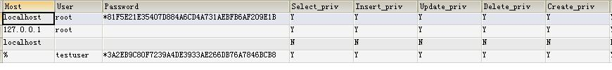
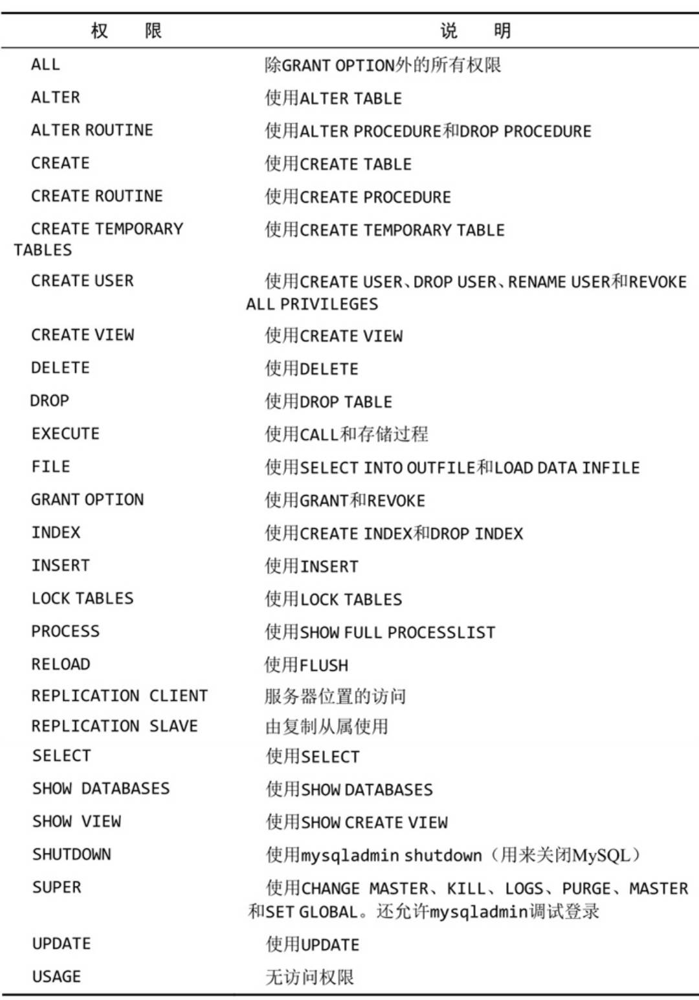

# 安全机制

## 安全管理（权限管理）

对用户对数据库的访问进行控制，尽量不要让用户使用`root` 账户进行操作，避免不必要的错误。

在`mysql` 中的名为 `mysql` 的数据库中的名为 `user` 的表内存有用户信息

```sql
use mysql; # 使用mysql数据库
select user from user; # user表中的user列存储的是用户登录名
```

### 创建用户账号

```sql
create user ben identified by 'p@$$w0rd'; # 创建用户,这样创建的用户无法在本机mysql上登录
```

在数据库中创建一个用户 testuser@% 是无法在本地登录的。其原因就在于mysql库的user表中有如下的数据：

 
 

   登录的时候先会去比对host再比对user再验证密码。

 使用用户名testuser登录，会先找到localhost，然后查找user时会查不到，所以无法登录。

 要想让testuser能本地登录，就要添加一个testuser@localhost。

   另：不用用户名也可以本地登录`MySQL`，用的账号就是上面的`@localhost`。

```sql
create user 'ben'@'localhost' identified by 'p@$$w0rd'; # 这样创建用户就可以在本机mysql登录
```

### 重命名用户

```sql
rename user ben to bforta; # mysql 5之后才支持，之前直接update user表更改
```

### 删除用户

```sql
drop user bforta; # mysql 5之后，该语句可以直接删除用户及该用户的权限，在之前，不能删除权限，需要先用revoke语句删除权限
```

### 修改用户密码

```sql
# mysql 5.7 之前
set password for ben@localhost = password('lqh24786');
# 5.7 之后，mysql取消了passowrd()字段
alter user ben@localhost identified by 'lqh24786';
```

### 查看用户权限

```sql
show grants for 用户名; # 有时需要用用户名@主机名来查询

show grants for ben@localhost;
+-----------------------------------------+
| Grants for ben@localhost                |
+-----------------------------------------+
| GRANT USAGE ON *.* TO `ben`@`localhost` |
+-----------------------------------------+ # 代表没有权限
```

### 授予用户权限（ `grant` ）

```sql
grant all on *.* to 'ben'@'localhost'；
# 授予ben所有权限

grant select on crashcourse.* to ben@localhost; # 赋予ben查询crashcourse库的权限

grant select,update on crashcourse.* to ben@localhost; # 一次授予多个权限
```

### 删除用户权限（ `revoke` ）

```sql
revoke select on crashcourse.* from ben@localhost; # 删除ben在crashcourse中查询的权限
```

###  `grant` 和 `revoke` 权限层次

- 服务器

  ```sql
  grant all;
  revoke all;
  ```

- 数据库

  ```sql
  on database.*
  ```

- 特定表

  ```sql
  on database.table
  ```

- 特定的列

- 特定的存储过程




​	**授权时，用户账号必须存在，但是涉及到的对象（对哪些数据拥有权限）可以不存在。所以，在数据库或者表被删除后，权限依然存在，当重建后，权限依旧存在。**  


## 数据库维护

### 数据库备份

应该先刷新未写数据，保证所有数据都被写入到磁盘中（包括索引数据）

```sql
flush tables;
```

- `mysqldump` 

- `mysqlhotcopy`

- ```sql
  backup table
  select into outfile
  # 转储到某个外部文件，接收系统将要创建的文件名（必须不存在）
  restore table # 复原数据
  ```

### 数据库维护

- `analyze table` 用来检查表键是否正确。

  ```sql
  analyze table orders;
  +--------------------+---------+----------+----------+
  | Table              | Op      | Msg_type | Msg_text |
  +--------------------+---------+----------+----------+
  | crashcourse.orders | analyze | status   | OK       |
  +--------------------+---------+----------+----------+
  ```

- `check table` 用来针对许多问题对表进行检查。在 `MyISAM` 表上还可以对索引进行检查。
  支持一系列用于 `MyISAM` 表的方式。`changed` 检查自最后一次检查以来改动过的表。 `extended` 执行最彻底的检查。 `fast` 只检查未正常关闭的表。 `medium` 检查所有被删除的链接并进行键检验。 `quick` 只进行快速扫描。

  ```sql
  check table orders,orderitems;
  +------------------------+-------+----------+----------+
  | Table                  | Op    | Msg_type | Msg_text |
  +------------------------+-------+----------+----------+
  | crashcourse.orders     | check | status   | OK       |
  | crashcourse.orderitems | check | status   | OK       |
  +------------------------+-------+----------+----------+
  ```

- `repair table` 用来修复 `MyISAM` 表，如果访问产生不正确和不一致的结果的话

- 如果从一个大表中删除大量数据，应该使用 `optimize table` 来回收所用的空间，优化表的性能

### 查询日志文件

- 错误日志：包含启动和关闭问题以及任意关键错误的细节。

  ```
  --log-error
  ```

- 查询日志：记录所有 `MySQL` 活动。

  ```
  --log
  ```

- 二进制日志：记录更新过数据（或者可能更新过数据）的所有语句

  ```
  --log-bin
  ```

- 缓慢查询日志：记录执行缓慢的任何查询。

  ```
  --log-slow-queries
  ```

在使用日志时，可用 `flush logs` 来刷新和重新开始所有日志文件

## 控制操作权限

可以通过配置`MySQL`的`sql_safe_updates`来限制用户执行没有`where`条件的`update`、`delete`语句

```sql
-- 查看是否开启安全更新机制
show variables like 'sql_safe_updates';
```

```sql
-- 开启安全更新机制，只是在当前会话中开启
set @@sql_safe_updates = ON;
```

当开启后执行不带where条件的更新语句时会提示

```sql
You are using safe update mode and you tried to update a table without a WHERE that uses a KEY column. 
```


## *注意事项

1. `mysql` 在执行匹配时默认不区分大小写.

2. `and` 操作符优先级高于 `or` ，可用 `()` 进行分组。

3. 从技术上讲， `distinct` 可用于 `min max` ，但是这没有任何意义。

4. 在设计表时，尽量做到一个表只存储一类信息，两个或者多个表之间通过主外键相互关联。

5. `insert` 非常消耗性能，有可能降低等待处理的 `select` 语句的性能。可以设置优先级

   ```sql
   insert low_priority into
   ```

6. 所有 `MySQL` 变量都必须以 `@` 开始

7. `declare` 语句，定义变量语句放在定义游标语句之前，定义游标语句放在定义句柄语句之前。

8. 要保证触发器在数据库中名字唯一

9. `mysql` 权限使用 ***用户名 `@` 主机名*** 结合定义。如果不指定主机名，则使用默认的主机名% (授予用户访问权限而不管主机名)