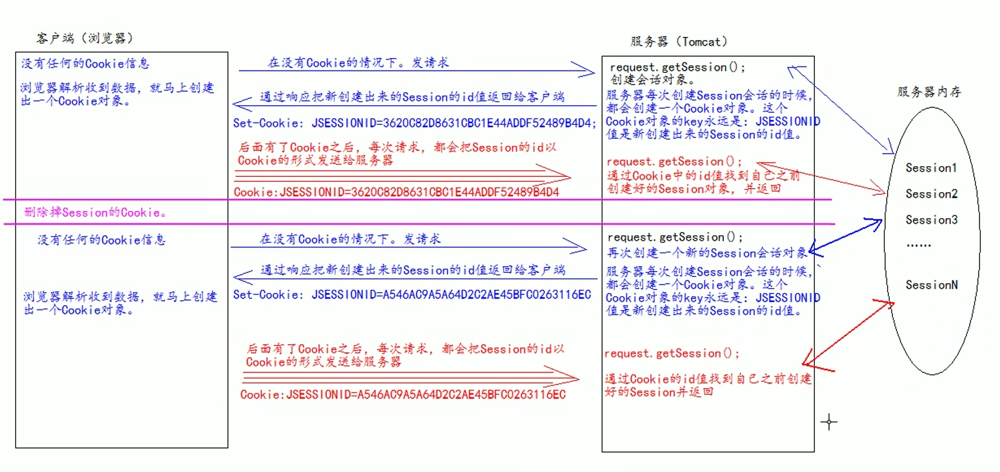

# Session

## Session基本概念

Session，会话，存储**特定用户**会话所需的属性及配置信息。这样，当用户在应用程序的Web页之间跳转时，存储在Session对象中的变量将不会丢失，而是在整个用户会话中一直存在下去。当用户请求来自应用程序的 Web页时，如果该用户还没有会话，则Web服务器将自动创建一个 Session对象。当会话过期或被放弃后，服务器将终止该会话。

Session是与用户绑定的，即一个用户在会话开始后直到Session生命周期结束（过期），Session都是唯一的。

Session存储在服务器上，只有服务器能够操作，更加安全。

Session技术是基于Cookie技术实现的。

 

## 钝化与活化

> session借助序列化实现

- 钝化：将session对象（存储的数据）序列化到磁盘上存储，一般用于服务器关闭时；或内存不足时，将长时间不用的session钝化
- 活化：将磁盘上序列化的session对象（存储的数据）反序列化到内存中使用，一般用于服务器开启时；或某个session突然需要被使用时